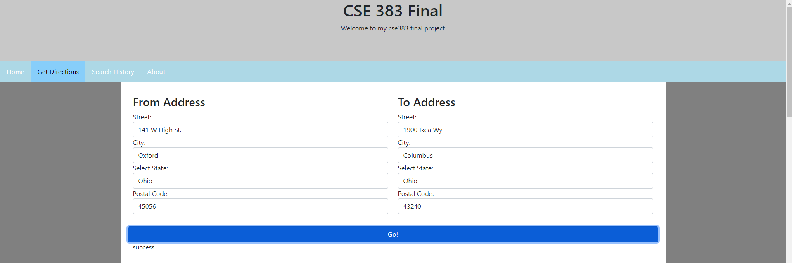

# Directions Webpage
This webpage is meant to act a directions giving tool that uses the MapQuest API and Amazon Web Services to show directions to the user.

**NOTE:** At the time of this final AWS EC2 instances were down. As a result, the 'search history' and 'about' pages are unfinished.

# Link and Images
[Here](https://ceclnx01.cec.miamioh.edu/~howellk3/final/landing.html) is the link to the webpage

# Languages and Libraries
- HTML
- CSS
- Javascript
- Libraries and APIs
    - jQuery
    - [MapQuest Directions API](https://developer.mapquest.com/documentation/directions-api)
    - [Bootstrap](https://getbootstrap.com)
